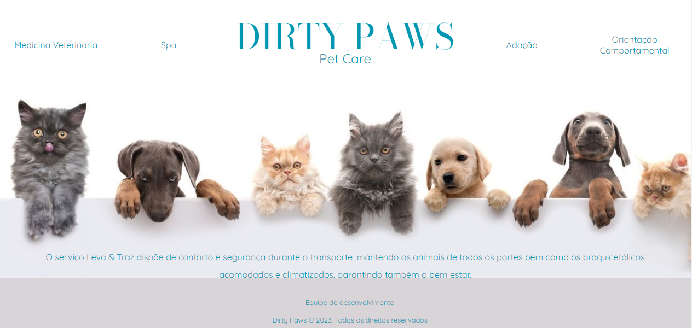
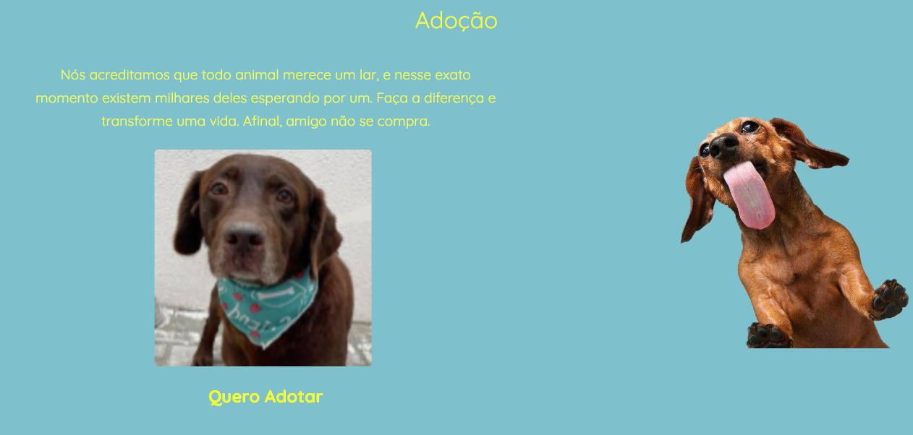

# Petshop - DIRTY PAWS

Este o projeto integrador proposto pela PROZ. Densenvolver um site com até 5 páginas, com o conteúdo aprendido no curso
HTML - CSS & Javascript.

O petshop possui 5 páginas, seguindo um layout de exemplo disponível no Canva.

## Páginas

1. **Página Inicial**: Apresentação do petshop, informações gerais e destaques dos serviços oferecidos.

2. **Medicina Veterinária**: Parte em que o nosso cliente pode realizar um preenchimento de formulário para entrar em contato conosco.

## Abrindo o formulário de preenchimento.

3. **SPA**: Lista de produtos disponíveis no petshop, com descrição.

## SPA Principal

## Hiegene - Descrição

## SPA - Descrição

## Estética - Descrição

4. **Adoção**: Em nossa página de adoção disponibilizamos imagens dos animais disponíveis e clicando em Quero adotar leva ao site para realizar o cadastramento. 

5. **Orientação Comportamental**: Página destinada a ensinamentos para os donos de seus animais.

](<assets/img/Orientacao comportamental.png>)

## Tecnologias Utilizadas

- HTML
- CSS (Finalizado)
- JavaScript (Manipulação do DOM, e Formulário Interativo, guardando as informações no Banco de dados do LocalStorage)

## Participantes
Matheus Torquete
 
Raisa Baccilieri
 
Priscilha Alves
 

## Como Contribuir

Se você quiser contribuir para este projeto, siga as etapas abaixo:

1. Faça um fork deste repositório
2. Crie uma nova branch com a sua contribuição: `git checkout -b minha-contribuicao`
3. Faça as alterações desejadas e faça commit das mesmas: `git commit -m "Minha contribuição"`
4. Envie as suas alterações para o repositório remoto: `git push origin minha-contribuicao`
5. Abra um Pull Request no GitHub

